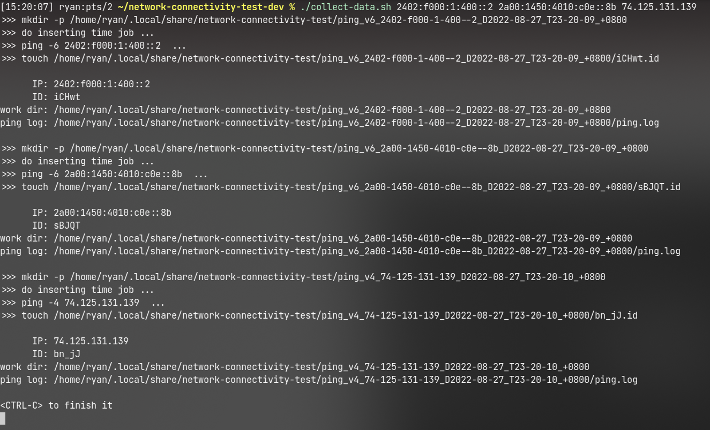
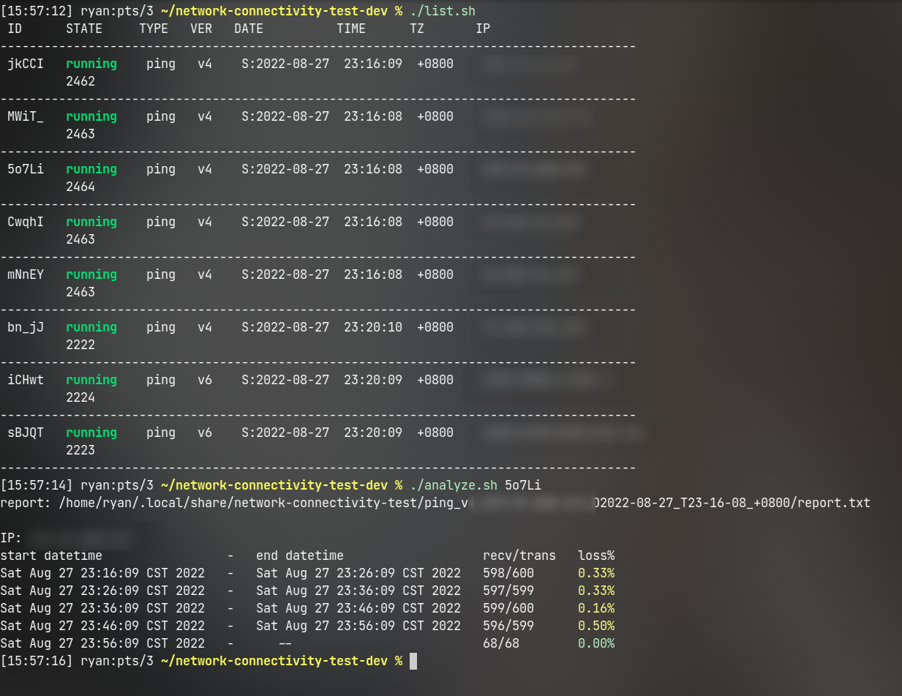

### a suite of scripts to analyze network connectivity

It is suitable for long-term uninterrupted testing to determine which time period is prone to packet loss.

```bash
# 1. collect ping data by
./collect-data.sh <ip>...

# 2. analyze data when enough data collected
./analyze.sh <id> | <work-path>

# you can use ./list.sh to show the collected list
#             ./remove.sh to delete specified item quickly
```

#### screenshots




