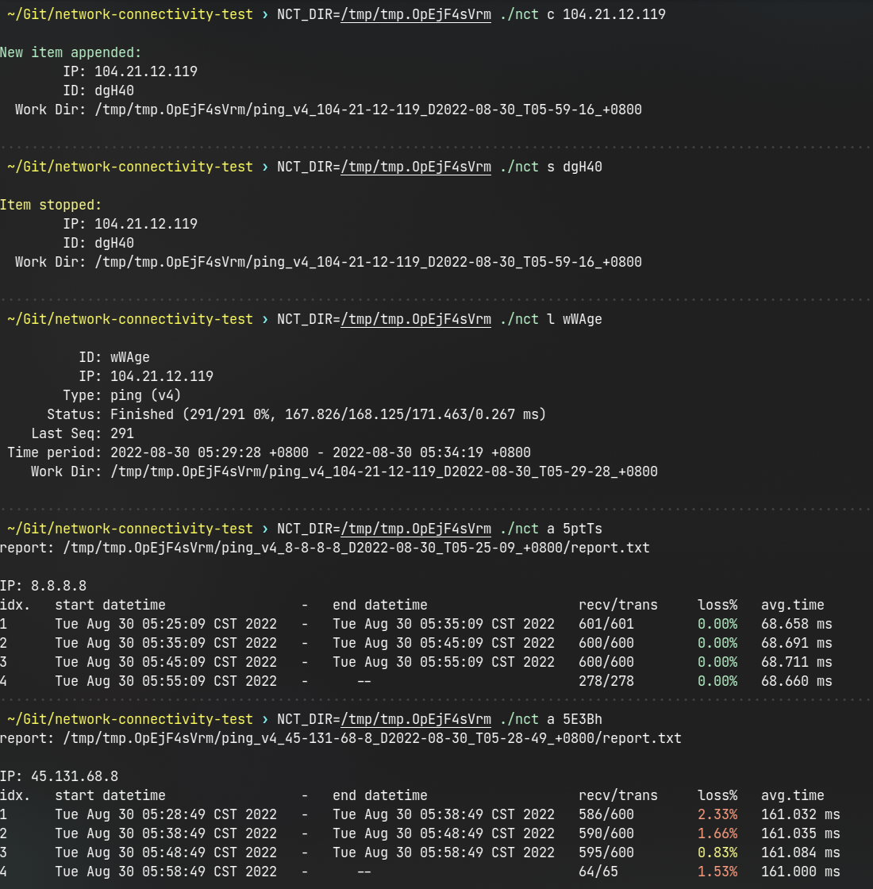
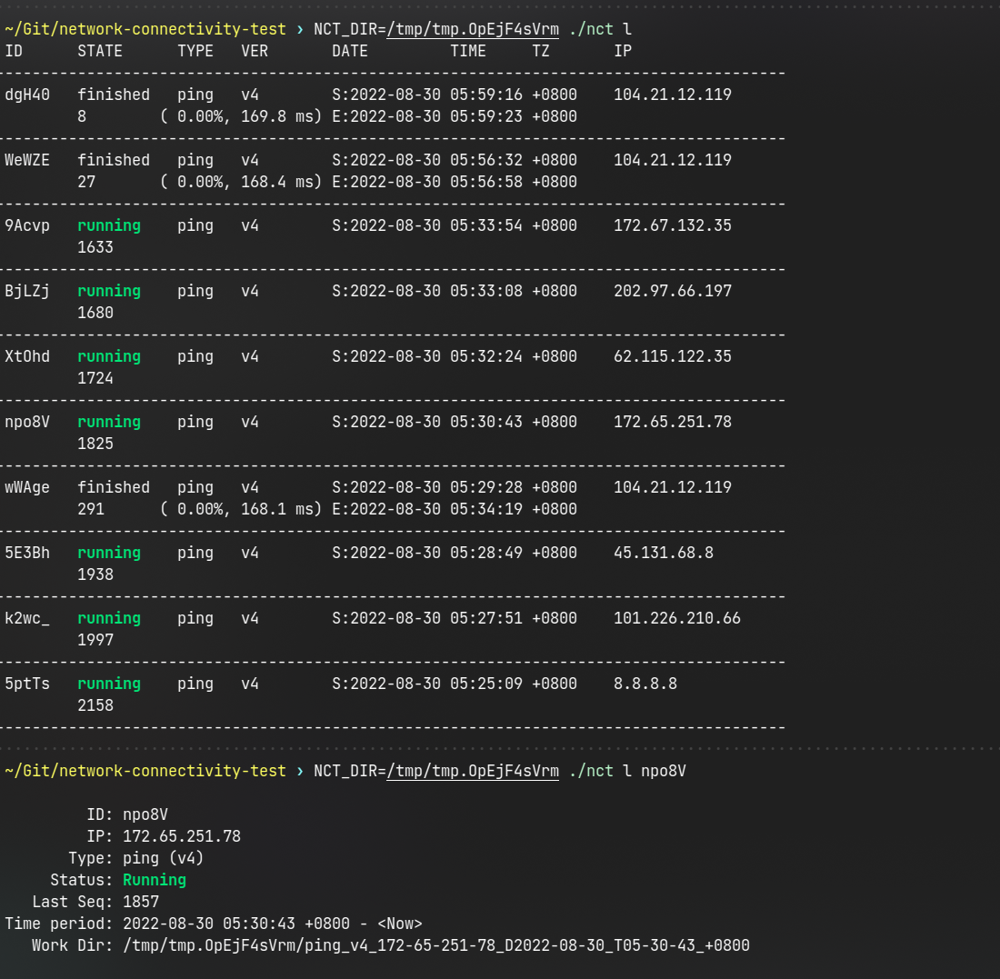

### a suite of scripts to analyze network connectivity

* use ping to test
* be suitable for long-term uninterrupted testing to determine which time period is prone to packet loss

Depends on

* `nc` _(openbsd-netcat)_
* `bc`
* other basic Linux commands

```bash
$ ./cnt help
Usage: nct <cmd> [<option>...]

      a, analyze  <ID>                  analyze the collect data
      c, collect  <IP>...               start collect data job(s) by IP
                                        OR append new job(s) to the current process
      l, list                           list all items
                  [<ID>]                list details of specified ID
                  [r|f] [<IP>]             r: filter by running state
                                           f: filter by finished state
                                        <IP>: filter by IP address
      s, stop     <ID>...               stop the job(s) of specified item by ID from current process
     rm, remove   <ID>...|<PATH>...     remove all data of specified item by ID or Work Dir PATH
    clr, clear    <ID>...|<PATH>...     clear the cache of specified item by ID or Work Dir PATH

```

#### tutorial

**terminal #0**

```bash
# start the main process,
# and also append 8.8.8.8 and 104.21.12.119 to the job list
$ ./nct c 8.8.8.8 104.21.12.119
# it will continue to wait for subsequent requests.
```

**terminal #1**

```bash
# automatically determine whether there is a main process running,
# communite with the main process,
# and append 172.65.251.78 to the job list
$ ./nct c 172.65.251.78
# will exit when the request is complete

# list all the jobs
$ ./nct l

# list all running jobs
$ ./nct l r

# analyze a specified job
$ ./nct a <ID>

# stop a running job
$ ./nct s <ID>

# remove a finished job
$ ./nct rm <ID>
```

#### screenshots




